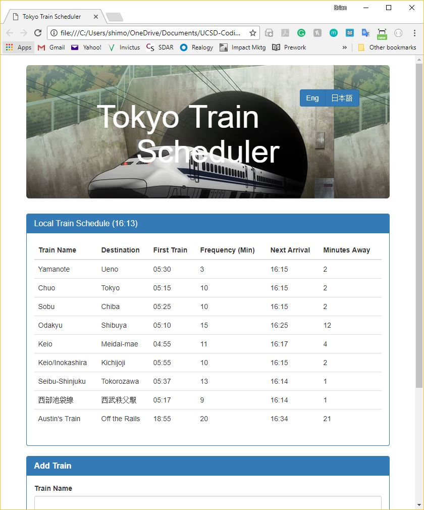
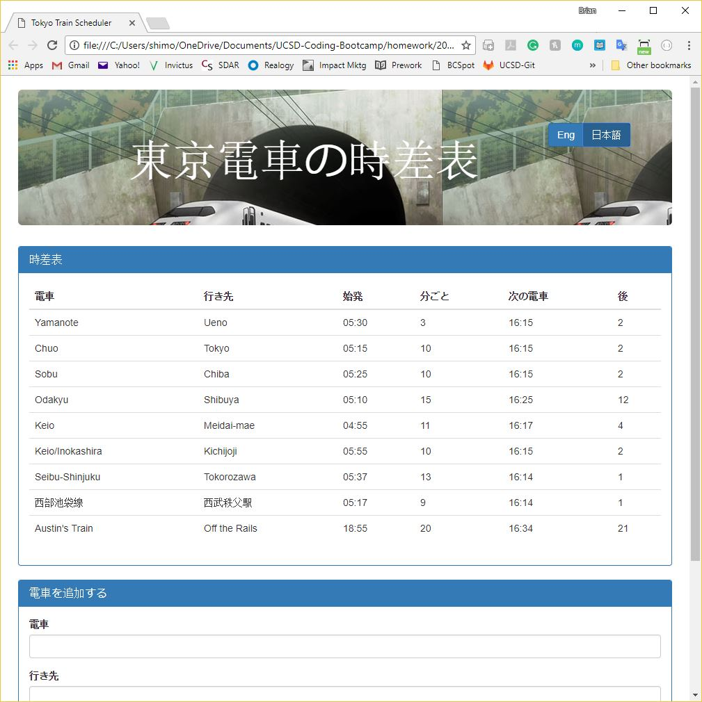

# Train-Scheduler

Technology: Javascript, Firebase realtime database, Moment.js

This is  a train schedule application that incorporates Firebase to host arrival and departure data. The app will retrieve and manipulate this information with Moment.js. This website will provide up-to-date information about various trains, namely their arrival times and how many minutes remain until they arrive at their station.

It is also bilingual, and will switch between English and Japanese.

